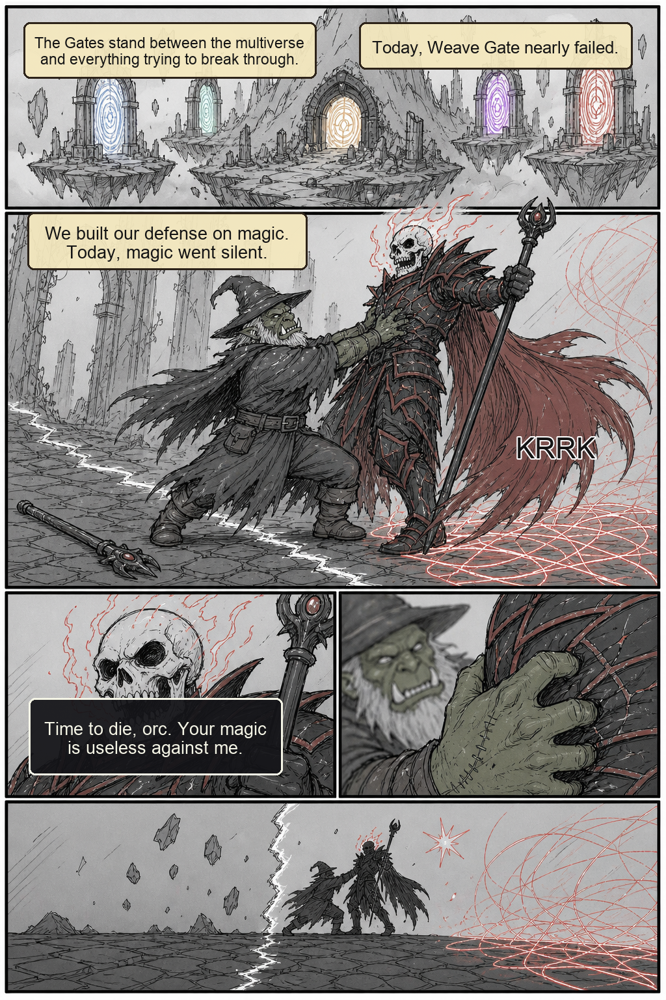

# Weave Gate Comic Images

Generated comic images are stored here, with page scripts and lettering JSON in the same planning folder.

## Comic Reader

- [Comic book](comic-book.md)
- [Comic plan](2026-03-10-weave-gate-origin-gem-dominion-comic-plan.md)
- [Page 00 script](2026-03-10-weave-gate-origin-gem-dominion-page-00-script.md)
- [Page 01 script](2026-03-10-weave-gate-origin-gem-dominion-page-01-script.md)
- [Page 02 script](2026-03-10-weave-gate-origin-gem-dominion-page-02-script.md)
- [Page 03 script](2026-03-10-weave-gate-origin-gem-dominion-page-03-script.md)
- [Page 04 script](2026-03-10-weave-gate-origin-gem-dominion-page-04-script.md)
- [Page 05 script](2026-03-10-weave-gate-origin-gem-dominion-page-05-script.md)

## Lettered Pages

## Base Art

- [Page 00 base art](visual-drafts/page-00-art-base.png)
- [Page 01 base art](visual-drafts/page-01-art-base.png)

## Lettering JSON

- [Page 00 lettering](visual-drafts/page-00-lettering.json)
- [Page 01 lettering](visual-drafts/page-01-lettering.json)

## Rough Thumbnails

- [Page 01 rough thumbnail](visual-drafts/page-01-rough-thumbnail.png)
- [Page 02 rough thumbnail](visual-drafts/page-02-rough-thumbnail.png)
- [Page 03 rough thumbnail](visual-drafts/page-03-rough-thumbnail.png)
- [Page 04 rough thumbnail](visual-drafts/page-04-rough-thumbnail.png)
- [Page 05 rough thumbnail](visual-drafts/page-05-rough-thumbnail.png)
