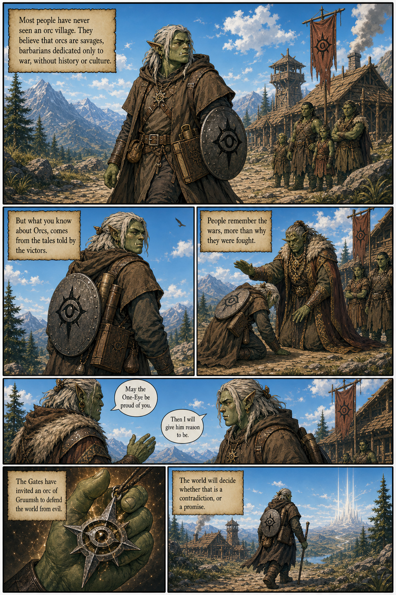
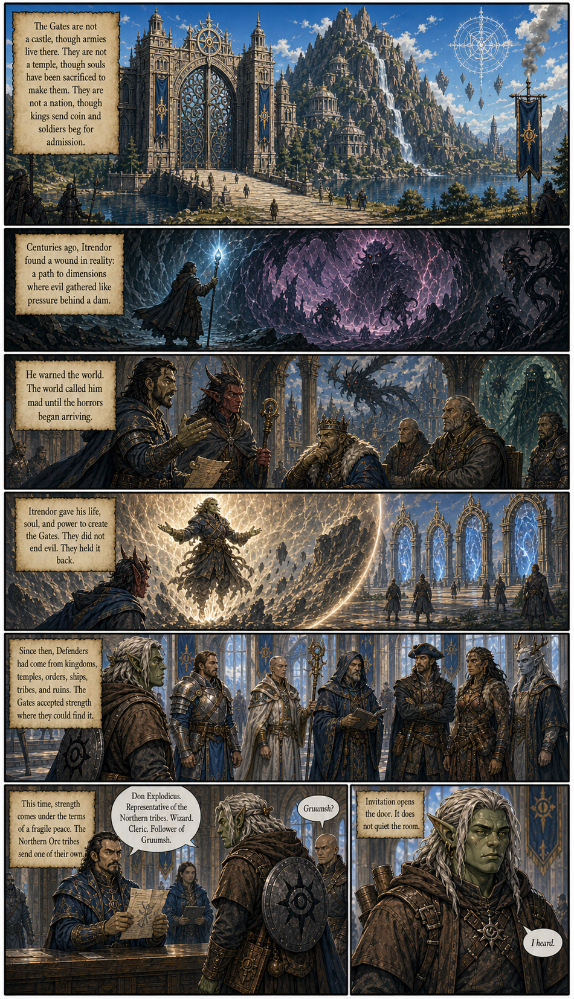
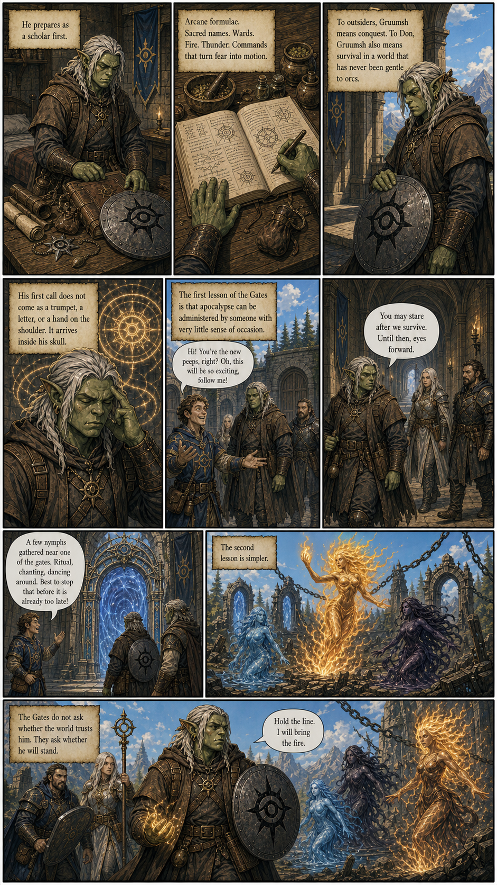

# Don Explodicus: Fire at the Gates

## Opening Sequence Draft

This is a rough comic-book reader for the current generated page drafts. These pages are intended for review and iteration; generated lettering may still need manual cleanup before publication.

## Page 1

## Page 2

## Page 3

## Related Files

- [Series bible](don-explodicus-series-bible.md)
- [Page 1 draft](visual-drafts/don-explodicus-page-01-blessing-healthy-arms-draft.png)
- [Page 2 draft](visual-drafts/don-explodicus-page-02-present-tense-draft.png)
- [Page 3 draft](visual-drafts/don-explodicus-page-03-normal-dialogue-draft.png)
